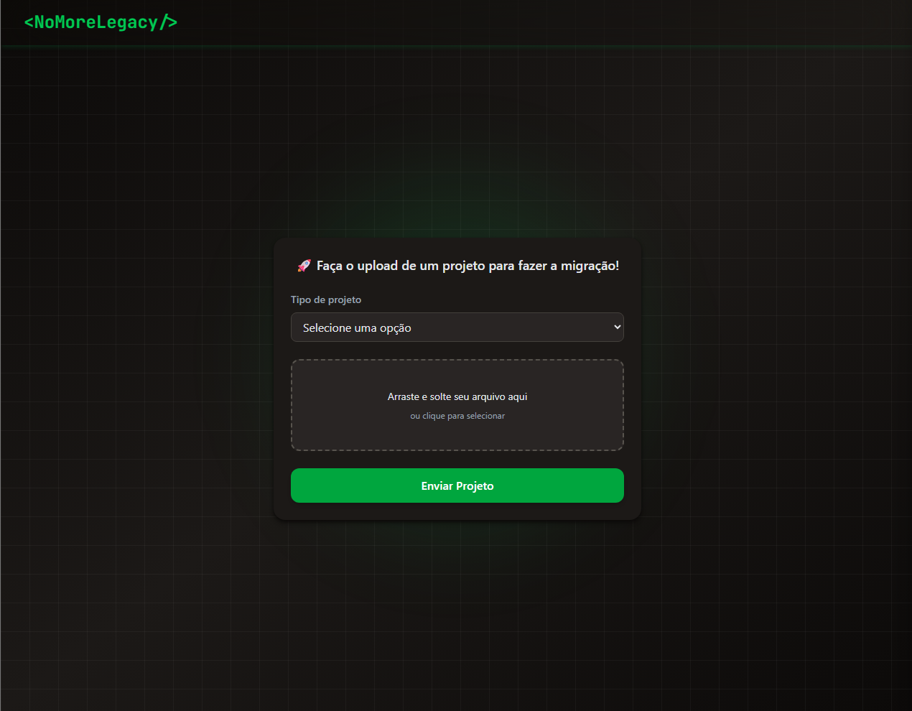

# &lt;NoMoreLegacy/&gt;

### ✨ Modernize seu código, um projeto de cada vez. ✨

[](https://opensource.org/licenses/MIT)
[](https://github.com/USUARIO/REPO)

## 👥 Contribuidores

-   André Chamis
-   Gabriel Amorim

---

O `<NoMoreLegacy/>` é uma ferramenta poderosa e intuitiva projetada para facilitar a vida de desenvolvedores que lidam com sistemas legados. A aplicação oferece uma interface amigável para fazer o upload de projetos antigos e iniciar um processo de migração automatizada para tecnologias mais modernas.

Diga adeus à dor de cabeça da manutenção de código obsoleto e abrace o futuro do desenvolvimento de software!

---

## 📸 Screenshot



---

## 🚀 Funcionalidades

-   **Interface Simples e Direta**: Um formulário limpo para focar no que importa: a migração.
-   **Upload por Drag & Drop**: Arraste e solte arquivos `.zip` do seu projeto legado de forma prática.
-   **Seleção de Framework**: Especifique o framework do projeto de origem para um processo de migração mais preciso.
-   **Validação de Formulário**: Feedback instantâneo para garantir que todas as informações necessárias foram fornecidas.
-   **Suporte a Frameworks Legados**: Suporte inicial para:
    -   Struts
    -   JSF (JavaServer Faces)
    -   JAX-RS (Java API for RESTful Web Services)
    -   AngularJS

---

## 🛠️ Tecnologias Utilizadas

Este projeto foi construído com as mais modernas tecnologias de front-end:

-   **React** - Para a construção da interface de usuário.
-   **TypeScript** - Para um código mais robusto e seguro.
-   **Tailwind CSS** - Para uma estilização moderna e ágil.
-   **Vite** (suposição) - Como ferramenta de build e servidor de desenvolvimento.

---

## 📦 Como Começar

Para executar este projeto localmente, siga os passos abaixo.

### Pré-requisitos

-   Node.js (versão 18 ou superior)
-   Yarn ou npm

### Instalação

1.  **Clone o repositório:**
    ```bash
    git clone [https://github.com/SEU_USUARIO/no-more-legacy.git](https://github.com/SEU_USUARIO/no-more-legacy.git)
    cd no-more-legacy
    ```

2.  **Instale as dependências:**
    ```bash
    npm install
    # ou
    yarn install
    ```

3.  **Configure as variáveis de ambiente:**
    Crie uma cópia do arquivo de exemplo `.env.example` e renomeie para `.env`.
    ```bash
    cp .env.example .env
    ```
    Edite o arquivo `.env` com as configurações necessárias (por exemplo, a URL da API de migração).
    ```
    VITE_API_BASE_URL=http://localhost:8080/api
    ```

4.  **Execute a aplicação:**
    ```bash
    npm run dev
    # ou
    yarn dev
    ```

Abra `http://localhost:5173` (ou a porta indicada no terminal) no seu navegador para ver a aplicação em funcionamento.

---

## 📖 Como Usar

1.  Acesse a página principal da aplicação.
2.  No campo **"Tipo de projeto"**, selecione o framework do seu projeto legado.
3.  Arraste e solte o arquivo `.zip` do seu projeto na área indicada ou clique para selecioná-lo.
4.  Com os campos preenchidos, o nome do arquivo aparecerá na tela.
5.  Clique no botão **"Enviar Projeto"** para iniciar o processo de migração.

---

---

## 📜 Licença

Distribuído sob a Licença MIT. Veja `LICENSE.txt` para mais informações.